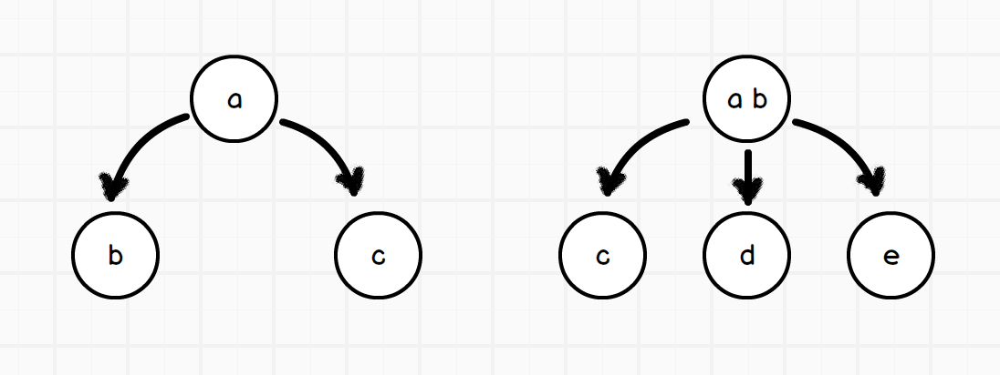
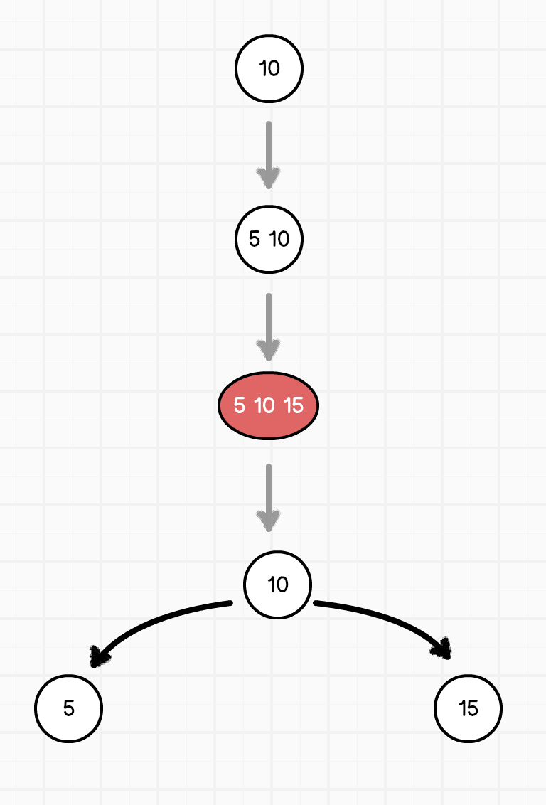
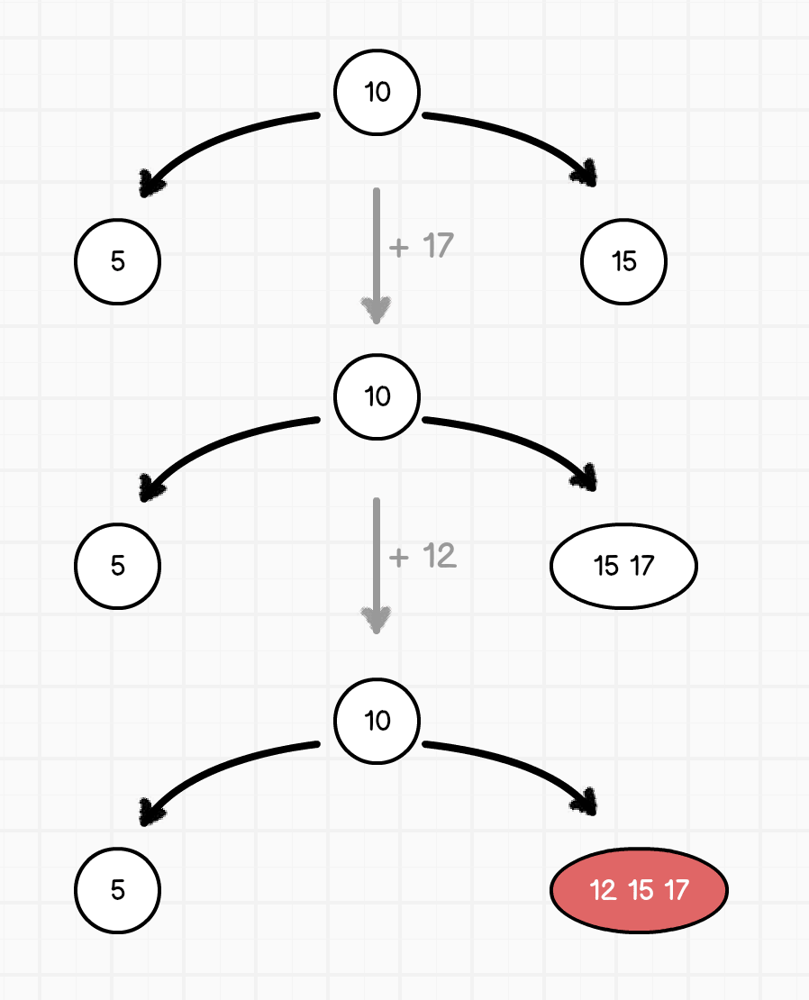
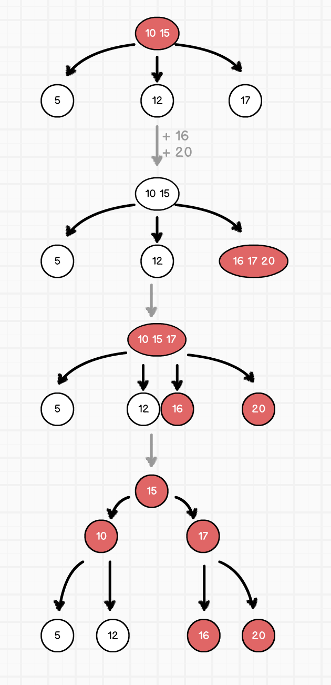

<!-- START doctoc generated TOC please keep comment here to allow auto update -->
<!-- DON'T EDIT THIS SECTION, INSTEAD RE-RUN doctoc TO UPDATE -->
**Table of Contents**  *generated with [DocToc](https://github.com/thlorenz/doctoc)*

- [2-3 二叉搜索树](#2-3-%E4%BA%8C%E5%8F%89%E6%90%9C%E7%B4%A2%E6%A0%91)
  - [节点搜索](#%E8%8A%82%E7%82%B9%E6%90%9C%E7%B4%A2)
  - [节点插入](#%E8%8A%82%E7%82%B9%E6%8F%92%E5%85%A5)
  - [节点删除](#%E8%8A%82%E7%82%B9%E5%88%A0%E9%99%A4)
    - [删除非叶子节点](#%E5%88%A0%E9%99%A4%E9%9D%9E%E5%8F%B6%E5%AD%90%E8%8A%82%E7%82%B9)
    - [删除叶子节点](#%E5%88%A0%E9%99%A4%E5%8F%B6%E5%AD%90%E8%8A%82%E7%82%B9)

<!-- END doctoc generated TOC please keep comment here to allow auto update -->

## 2-3 二叉搜索树

2-3 二叉搜索树的每个节点要么有 2 个子节点和 1 个数据元素，要么有 3 个子节点和 2 个数据元素。



而节点上的值有其特征：

- 如上图左边的树所示，它和普通的二叉搜索树没有差别，左子节点 b 的值小于 a，右子节点 c 的值大于 a；
- 如上图右边的树所示，它的节点里有两个值，而且有三个子节点。其中，左子节点 c 小于 a，中间节点 d 位于 a, b 之间，而右子节点 e 则大于 b

所以在 2-3 二叉搜索树中，我们不会像其他二叉搜索树那样直接得知它各个节点的值和左右子树，而是使用数组来表示：

```javascript
class Node {
  constructor(val = null, parentNode = null) {
    this.parentNode = parentNode;
    this.values = val ? [val] : [];
    this.childs = [];
  }

  get leftVal() {
    return this.values[0];
  }

  get rightVal() {
    return this.values.slice(-1)[0];
  }

  get leftChild() {
    return this.childs[0];
  }

  get midChild() {
    return this.childs[(this.childs.length - 1) / 2];
  }

  get rightChild() {
    return this.childs.slice(-1)[0];
  }
}
```

### 节点搜索

节点搜索和普通的二叉搜索树没有什么差别，通过和节点上的多个值比较，确定继续搜索它的左节点、中节点还是右节点。

```javascript
class Node {
  // 根据值的大小比较来确定去哪个子节点寻找
  getTargetChild(val) {
    if (val < this.leftVal) {
      return this.leftChild;
    }
    if (val > this.rightVal) {
      return this.rightChild;
    }
    return this.midChild;
  }

  // 寻找当前节点里是否有匹配的值
  checkMatched(val) {
    return this.values.find(value => value === val);
  }

  find(val) {
    // 在当前节点就查询到了目标值
    if (this.checkMatched(val)) return this;
    // 已经处于最底层节点且没有查询到结果，则返回 null
    if (!this.childs.length) return null;

    const targetChild = this.getTargetChild(val);
    return targetChild.find(val);
  }
}
```

### 节点插入

在插入值的过程中，**最底层节点都会尽力的让自己包含的元素增多**。比如一开始的根节点只有一个数字，在插入第二个的时候，新的数字会被插入到根节点中，此时根节点里有两个元素。再继续插入第三个树，则它也会**临时的**放置到根节点里，然后紧接着从根节点中提取出位于中间的值，然后把节点分裂为两个。具体过程如下图所示：



在那之后继续插入数据。先插入 `17`，此时 17 被插入到 15 所在的节点中，因此具有了两个元素。然后继续插入 `12`，12 位于 `15 17` 之间，所以临时将其插入到两值的节点中，此时该节点内有三个值（临时节点）：



然后取三值节点中的中间值，将它提升到父节点上；同时将这个节点分类为两个节点，成为其父节点的中、右子节点：


这样，树就重新恢复了平衡。

如果继续插入元素使最右的子节点不断增长，例如以此插入 `16` 和 `20`，则整个过程如下图所示：



```javascript
class Node {
  push(val) {
    this.values.push(val);
    this.values.sort((pre, next) => pre - next);
  }

  // 弹出当前节点的中间值
  popMid() {
    const mid = this.values[1];
    this.values = [
      this.leftVal,
      this.rightVal
    ];
    return mid;
  }

  /*
   * 已上例为例，在依次插入 10 5 15 的过程中，根节点其实已经改变了，不再是一开始原本的那个根节点。因此，在插入完成之后返回新的根节点
  */
  // 循环获取根节点
  get root() {
    let parentNode = this.parentNode;
    if (!parentNode) return this;
    while (parentNode.parentNode) {
      parentNode = parentNode.parentNode;
    }
    return parentNode;
  }

  // 总是返回树的根节点
  insert(val) {
    let result = this.root;
    // 如果在当前节点就匹配，则直接返回
    if (this.checkMatched(val)) return result;
    if (this.childs.length) {
      // 如果还有子节点，则继续深入
      const targetChild = this.getTargetChild(val);
      targetChild.insert(val);
    } else {
      // 当已经到达最底层节点的时候，就把值插入到最底层节点内
      this.push(val);
    }
    if (this.values.length === 3) {
      // 节点内的值为 3 时，已经过饱和，处于中间临时状态。
      // 此时应该去除其中间的那个值，插入到父节点内；同时，当前节点剩下的两个值分别分裂成为两个新的节点，
      // 然后这两个节点也链接到他们原本的父节点上
      const mid = this.popMid();
      const parentNode = this.parentNode
        ? this.parentNode
        : new Node();
      parentNode.push(mid);
      parentNode.removeChilds(this.values);
      parentNode.pushChilds(
        ...this.mitosis()
      );
      result = parentNode.root;
    }
    return result;
  }

  // 给入一个 Array，判断当前节点的值中是否有 array 内的元素
  contain(values) {
    let contain = false;
    for (let i = 0; i < values.length; i += 1) {
      if (this.values.find(val => val === values[i])) {
        contain = true;
        break;
      }
    }
    return contain;
  }

  // 根据值来剔除掉自己直接链接的子节点
  removeChilds(values) {
    this.childs = this.childs
      .filter(child => !child.contain(values));
  }

  // 把其他节点链接成为自己的直接子节点
  pushChilds(...childs) {
    this.childs.push(...childs);
    this.childs.sort(
      (pre, next) => pre.leftVal - next.leftVal
    );
    childs.forEach(child => child.parentNode = this);
  }

  // 把当前节点中的值分裂成各个单独的节点
  // 当前节点中的子节点被均摊到新生成的各个节点中去
  mitosis() {
    const eachNodeChildsCount = this.childs.length / this.values.length;
    return this.values
      .map((value, index) => {
        const node = new Node(value);
        node.pushChilds(
          ...this.childs.slice(index * eachNodeChildsCount, (index + 1) * eachNodeChildsCount)
        );
        return node;
      });
  }
}
```

### 节点删除

#### 删除非叶子节点

直接用**中序遍历下的直接后继节点**替换当前被删除的节点


#### 删除叶子节点

- 删除的节点内有两个值（即 3 节点），则直接删除


- 删除的节点内仅一个值（即 2 节点）

1. 被删除节点的父节点是 2 节点，兄弟节点是 3 节点，则删除子节点后，类似左旋的替换


2. 被删除节点的父节点和兄弟节点都是 2 节点，则：

2.1. 移动兄弟节点中序遍历的直接后继节点 a 到兄弟节点
2.2. 则可利用步骤 1 的方式处理
2.3. 但此时相当于删除了 a 节点，则递归处理


3. 被删除节点的父节点是 3 节点，则拆分父节点成为 2 节点，再将拆分得到的某值和剩下的某个子节点合并


4. 2-3 树是满二叉树，则将树从层级减少，并将剩下的兄弟节点合并到父节点；同时将父节点的所有兄弟节点合并到父节点的父节点中


