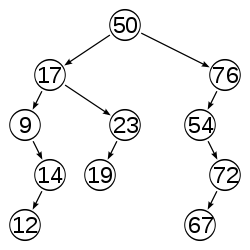
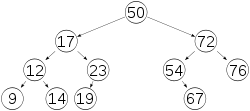
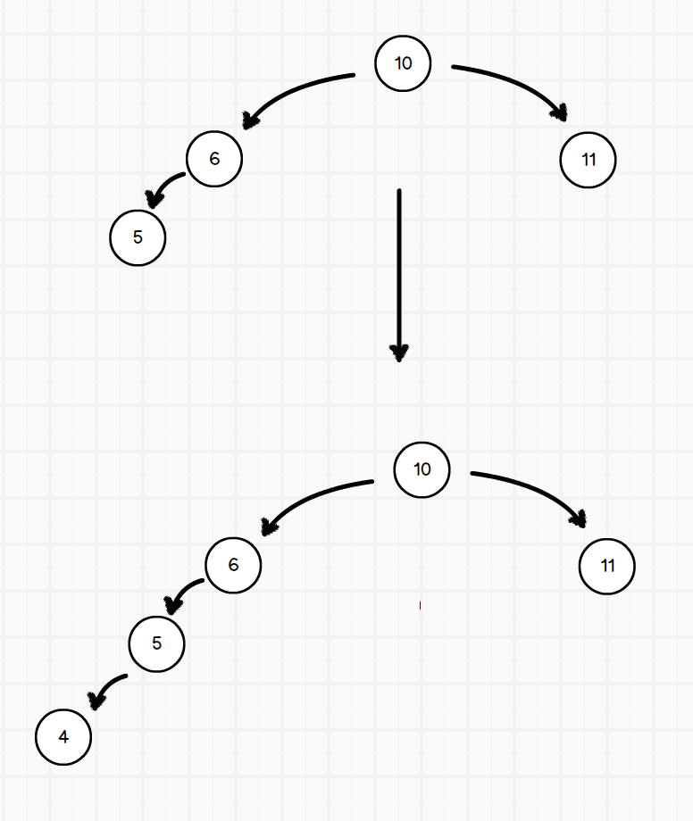
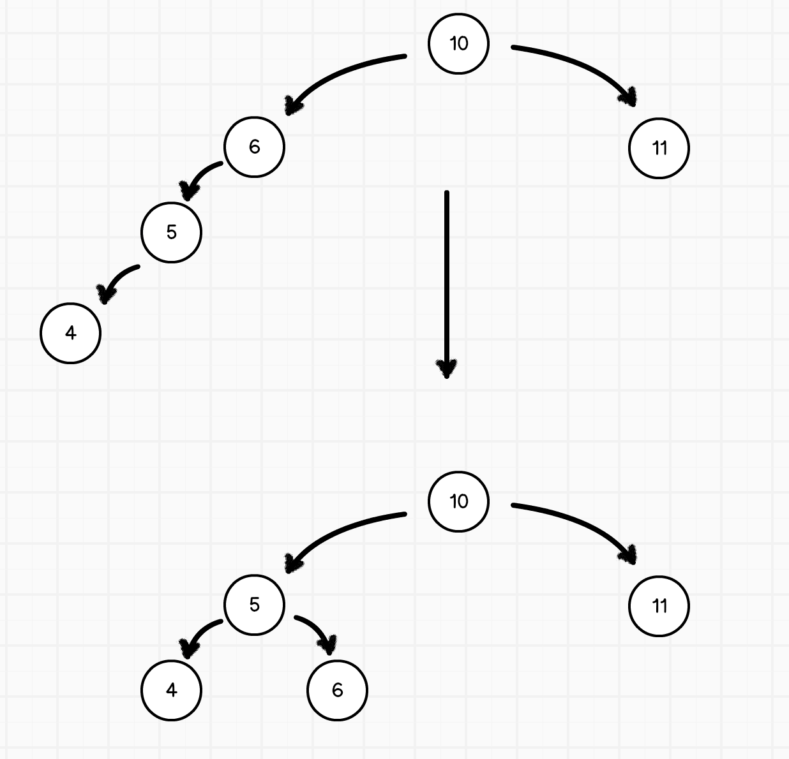
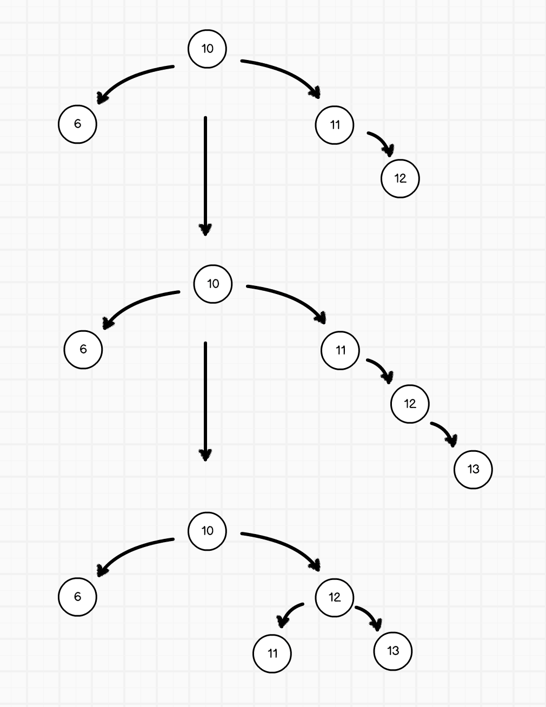
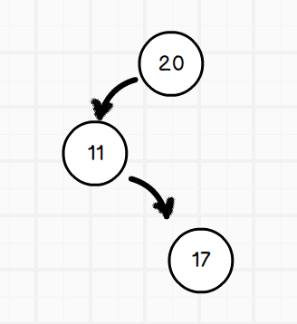
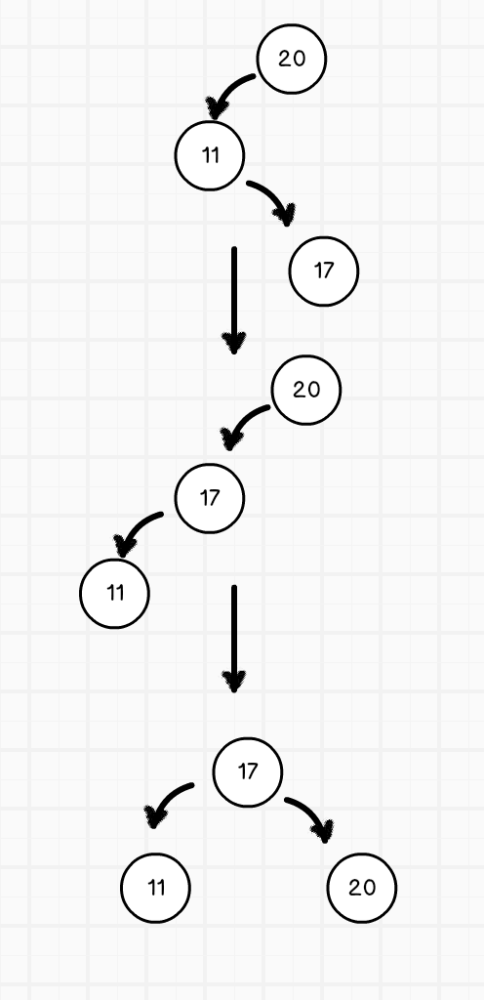
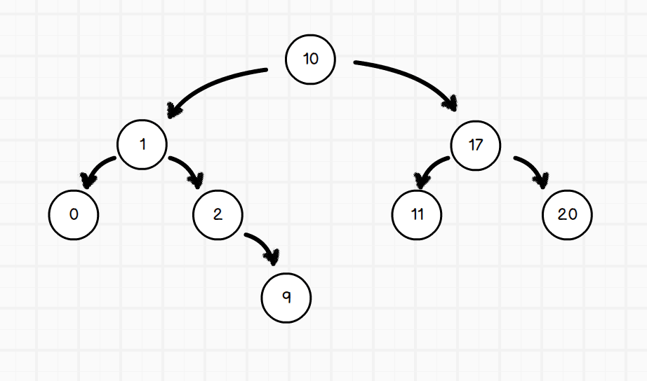

## AVL 树

一般的二叉查找树的查询复杂度是跟目标结点到树根的距离（即深度）有关，因此当结点的深度普遍较大时，查询的均摊复杂度会上升，为了更高效的查询，平衡树应运而生了。

在这里，平衡指所有叶子的深度趋于平衡，更广义的是指在树上所有可能查找的均摊复杂度偏低。

如下图所示，分别为非平衡树和平衡树的样子（图片来源[维基百科平衡树](https://zh.wikipedia.org/wiki/AVL%E6%A0%91)）：





AVL 树是平衡二叉搜索树的一种，具有以下性质：它是一棵空树，或**它的左右两个子树的高度差的绝对值不超过 1**，并且左右两个子树都是一棵平衡二叉树。利用这种平衡的性质，可以避免二叉搜索树某个子节点过深，或者树删除元素重新排列导致某节点过深的失衡问题。

### 数据查找

AVL 树的查找过程和[二叉搜索树](./binary-search-trees)一致

### 数据插入

当插入一个数据，使 AVL 树失去平衡时，无非有四种情况（及其应对方案）：

- 左左失衡（左子树的左子节点）- 通过单向右旋应对
- 右右失衡（右子树的右子节点）- 通过单向左旋应对
- 左右失衡（左子树的右子节点）- 双向旋转，先左后右
- 右左失衡（右子树的左子节点）- 双向旋转，先右后左


我们从头开始分析一下当 AVL 数失衡时的情况。假设有一个二叉搜索树，我们在其初始化之后开始往数上填充内容。

```javascript
/*
 * ATTENTION
 * 在改变节点的父节点、子节点时，是一个双向的过程
 * 已设置 A 节点的左子节点为 B 为例，
 * 既需要把 A 节点的 leftChild 设置为 B，也需要把 B 的 parent 设置为 A
*/
```

#### 左左失衡

在一个空的二叉搜索树上一次填入 `10, 6, 11, 5`，然后在填入 `4` 后，构成如下的树状结构：



很明显，在插入了 4 之后，首先从 6 所在的树已经失去平衡，而造成这种情况的正是失衡点 6 左边子树的左子节点，因此叫做左左失衡。左左失衡的处理方式比较简单，只要对 `6 -> 5 -> 4` 所在的树做一次旋转即可



```javascript
/*
 * 右旋，应对左左失衡
 * 1. 传入失衡的节点 a
 * 2. 获取 a 的左子节点 aChildLeft
 * 3. 把 aChildLeft 提升到 a 的位置
 *    1. a 的父节点成为 aChildLeft 的父节点
 *    2. a 成为 aChildLeft 的右子节点
 * 4. aChildLeft 的原右子节点成为 a 的左子节点
 * 5. aChildRight 的左子节点还是其左子节点
*/
const rightRotate = (node) => {
// 获取 a 的右子节点 aChildLeft
const targetNode = node.leftChild;

  // 如果 a 还有父节点，则把 aChildLeft 作为 a 父节点的左子节点
  // 同时，把 aChildLeft 的父节点设置为了 a 的父节点
  if (node.parentNode) {
    // 为了能够让这个方法更通用，我们假设不知道当前节点是其父节点的左子节点还是右子节点，
    // 因此需要进行判断
    const parentChildPosition = node.isLeftChild
      ? 'leftChild'
      : 'rightChild';
    node.parentNode[parentChildPosition] = targetNode;
    targetNode.parentNode = node.parentNode;
  }
  // 之后，aChildRight 的原右子节点成为 a 的左子节点
  node.leftChild = targetNode.rightChild;
  targetNode.rightChild.parentNode = node;

  targetNode.rightChild = node;
  node.parentNode = targetNode;
};
```

#### 右右失衡

类似于左左失衡。在一个空的二叉搜索树上一次填入 `10, 6, 11, 12`，然后在填入 `13` 后，构成如下的树状结构，然后通过对 `11 -> 12 -> 13` 树进行左旋转调节：



```javascript
/*
 * 左旋，应对右右失衡
 * 1. 传入失衡的节点 a
 * 2. 获取 a 的右子节点 aChildRight
 * 3. 把 aChildRight 提升到 a 的位置
 *    1. a 的父节点成为 aChildRight 的父节点
 *    2. a 成为 aChildRight 的左子节点
 * 4. aChildRight 的原左子节点成为 a 的右子节点
 *    1. a 的右子节点为 aChildRight 的原左子节点
 *    2. aChildRight 的原左子节点的父节点改为 a
 * 5. aChildRight 的右子节点还是其右子节点
*/
const leftRotate = (node) => {
  // 获取 a 的右子节点 aChildRight
  const targetNode = node.rightChild;

  // 如果 a 还有父节点，则把 aChildRight 作为 a 父节点的右子节点
  // 同时，把 aChildRight 的父节点设置为了 a 的父节点
  if (node.parentNode) {
    // 为了能够让这个方法更通用，我们假设不知道当前节点是其父节点的左子节点还是右子节点，
    // 因此需要进行判断
    const parentChildPosition = node.isLeftChild
      ? 'leftChild'
      : 'rightChild';
    node.parentNode[parentChildPosition] = targetNode;
    targetNode.parentNode = node.parentNode;
  }
  // 之后，aChildRight 的原左子节点成为 a 的右子节点
  node.rightChild = targetNode.leftChild;
  targetNode.leftChild.parentNode = node;

  targetNode.leftChild = node;
  node.parentNode = targetNode;
};
```

#### 左右失衡

失衡点左子树的右子节点造成了失衡。如下如，我们先往空树中插入 `10, 1, 20, 11, 0, 2, 9`，然后再插入 `17`


妥妥的，20 所在节点失衡，造成失衡的是它左子节点的右子节点，因此是左右失衡。

我们单独把失衡的节点和它所有的子节点拎出来看，即 `20, 11, 17` 所在节点。



显然，这是个失衡的树。我们先将 `11, 17` 进行一次左旋转，然后再进行一次右旋转，即可让树恢复平衡：



将恢复平衡的树重新放入原有的树中，用新的节点 17 代替旧节点 20，就可得到下面的平衡二叉树：



```javascript
/*
 * 先左旋再右旋，应对左右失衡
 * 输入失衡的节点
*/
const lrRotate = (node) => {
  leftRotate(node.leftChild);
  rightRotate(node);
};
```

#### 右左失衡

右左失衡的情况和左右失衡类似，不再赘述。

```javascript
/*
 * 先右旋再左旋，应对右左失衡
*/
const rlRotate = (node) => {
  rightRotate(node.rightChild);
  leftRotate(node);
};
```

### 数据删除

类似于[二叉搜索树](../binary-search-trees)那样删除树中的元素，然后再重新让其恢复平衡。

```javascript
class Node {
  remove(val) {
    let findedNode = this.find(val);
    this.removeNode(findedNode);
  }

  removeNode() {
    // 跟二叉搜索树的方法基本一致
    // 省略了删除的代码

    // 但是最后我们需要让树恢复平衡
    const recheckNode = findedNode || parentNode;
    if (recheckNode) {
      const balance = recheckNode.balance;
      if (Math.abs(balance) > 1) {
        recheckNode.rebalanceAfterDel(balance);
      }
    }
  }

  // 根据删除完以后的子树的结构，来判断它是哪种情况的失衡
  rebalanceAfterDel(balance) {
    if (balance > 0) {
      // left
      if (this.leftChild.leftChild) {
        // 左左
        rightRotate(this);
      } else {
        // 左右
        lrRotate(this);
      }
    } else if (balance < 0) {
      // right
      if (this.rightChild.rightChild) {
        // 右右
        leftRotate(this);
      } else {
        // 右左
        rlRotate(this);
      }
    }
  }
}
```
