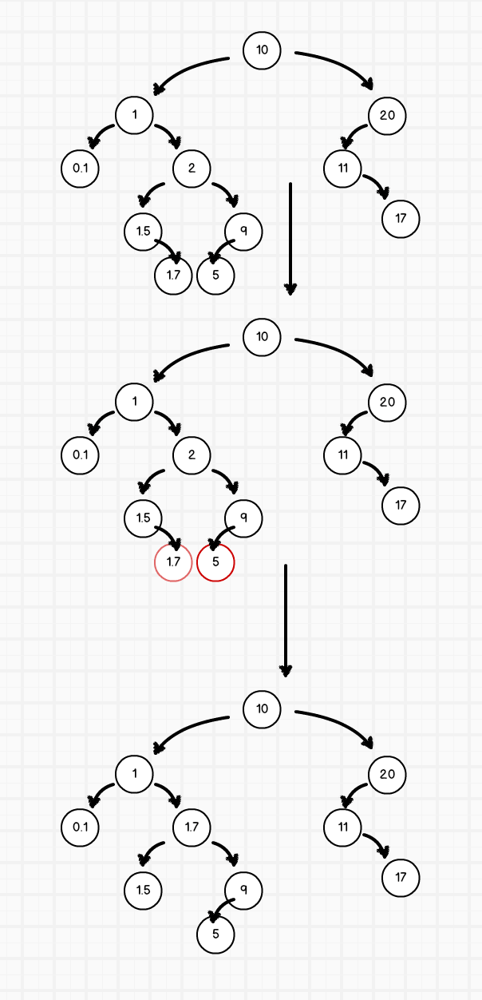

## 二叉搜索树

二叉搜索树是指具有如下性质的二叉树：

- 若任意节点的左子树不空，则左子树上所有节点的值均小于它的根节点的值
- 若任意节点的右子树不空，则右子树上所有节点的值均大于它的根节点的值
- 任意节点的左、右子树也分别为二叉查找树
- 没有键值相等的节点

即：**每个节点比其左子树元素大，比其右子树元素小**


### 二叉链表

如上所属，每个元素都要有 `left` 和 `right` 两个属性，代表其左子树和右子树，即可以看做是一个双向[链表](https://zh.wikipedia.org/wiki/%E9%93%BE%E8%A1%A8)：每个元素有一个指向上一个元素的索引和一个指向下一个元素的索引。

```bash
childLeft <-- (left) node (right) --> childRight
```

```javascript
class Node {
  constructor(val) {
    this.val = val;
    this.leftNode = null;
    this.rightNode = null;
  }

  get node() {
    return this.val;
  }

  set node(val) {
    this.val = val;
  }

  // get left child node value
  get left() {
    return this.leftNode ? this.leftNode.node : null;
  }

  // get left child node
  get leftChild() {
    return this.leftNode;
  }

  // set left child node
  set leftChild(leftNode) {
    if (leftNode !== null && this.node < leftNode.node) {
      throw new Error('Left node value should be smaller than root node value!');
    }
    this.leftNode = leftNode;
  }

  // get right child node value
  get right() {
    return this.rightNode ? this.rightNode.node : null;
  }

  // get right child node
  get rightChild() {
    return this.rightNode;
  }

  // set right child node
  set rightChild(rightNode) {
    if (rightNode !== null && this.node > rightNode.node) {
      throw new Error('Right node value should be bigger than root node value!');
    }
    this.rightNode = rightNode;
  }
}
```

对于传统的数组而言，我们增加或删除一个元素时，需要移动其之后的元素。比如删除了 `index` 为 10 的元素，那么之前 `index` 为 11 的元素需要向前挪动一位；同理，后面的每一个元素都要向前挪动一位。而对于链表而言，只需要增加或删除某个元素的索引即可，复杂度为 O(1)。当然链表也因此有它的缺点：数组可以直接通过 `array[index]` 访问到 `index` 位上的元素；而对于链表而言，需要从头开始遍历到目标元素。

因此，二叉搜索树利用了链接的数据储存结构，可以快速增删元素，同时得益于其自身的结构，在搜索时并不需要完全的遍历全部元素。因为每个节点都比其左子节点大，比右子节点小，所以会在各个节点进行判断，避免了不必要的遍历。

### 二叉搜索树的插入

从根节点开始插入，进行比较：

1. 如果 当前节点值 < value，则寻找其右子节点；
2. 如果 当前节点值 > value，则寻找其左子节点；
3. 如果节点值为空，则插入该元素；
4. 遍历上述操作直至插入；

```javascript
// 在 Node 中新增 insert 方法
class Node {
  // ...省略

  insert(val) {
    if (this.node < val) {
      // 如果要插入的值大于当前节点值，则寻找其右子节点
      if (this.right === null) {
        this.rightChild = new Node(val);
      } else {
        this.rightChild.insert(val);
      }
    } else if (this.node > val) {
      // 如果要插入的值小于当前节点值，则寻找其左子节点
      if (this.left === null) {
        this.leftChild = new Node(val);
      } else {
        this.leftChild.insert(val);
      }
    }
  }
}
```

### 二叉搜索树的搜索

搜索过程如下：

1. 若 target === 根节点的值，则查找成功；
2. 若 target < 根节点的值，则搜索左子节点；
3. 若 target > 根节点的值，则搜索右子节点；
4. 遍历上述操作直至查找到指定元素；

```javascript
// 在 Node 中新增 find 方法
class Node {
  // ...省略

  find(val) {
    // 若 target === 根节点的值，则直接查找成功
    if (this.node === val) return this;

    if (val < this.node) {
      // 若 target < 根节点的值，则搜索左子节点
      if (this.left === null) return null;
      return this.leftChild.find(val);
    } else if (val > this.node) {
      // 若 target > 根节点的值，则搜索右子节点
      if (this.right === null) return null;
      return this.rightChild.find(val);
    }
  }
}
```

### 二叉搜索树的删除

删除搜索树中某个节点时，需要判断三种情况：

1. 删除的节点没有左右子节点
2. 删除的节点只有左子节点或者右子节点
3. 删除的节点有左右子节点

- 当删除的节点没有左右子节点时，直接删除该节点即可

- 当删除的节点只有左子节点或者右子节点时，则删除目标节点，并把它的那个子节点提升一级

- 当删除的节点有左右子节点时：
  - 遍历目标节点的子节点，找到最接近目标节点值的元素，然后那它替代目标节点
  - 删除找到的那个节点（递归）

如何找到最接近目标节点值的元素？有个简单的方法是，找到*目标节点左子树的最右边的右子树*和*目标节点右子树最左边的左子树*，取两者之间更接近目标节点的元素。如果没有，则用第一层子树的值代替。



```javascript
// 已知传入的节点 A 具有左节点和右节点，返回节点值 A 最接近的 A 的子节点
const findClosestNode = (node) => {
  const val = node.node;
  const leftNode = node.leftChild.rightChild
    ? node.leftChild.rightChild
    : node.leftChild;
  const rightNode = node.rightChild.leftChild
    ? node.rightChild.leftChild
    : node.rightChild;

  return (rightNode.node - val) > (leftNode.node - val)
    ? leftNode
    : rightNode;
};

// 在 Node 中进行修改
class Node {
  // 为了方便，我们现在需要记录各节点的父节点
  constructor(val, parent = null) {
    this.val = val;
    this.parent = parent;
    this.leftNode = null;
    this.rightNode = null;
  }

  get parentNode() {
    return this.parent;
  }

  // 当我们改变了某个节点的子节点时，同时也要改变那个子节点的父节点，所以需要 set api
  set parentNode(parent) {
    this.parent = parent;
  }

  // 返回该节点的子节点数目
  get childNodeCount() {
    return (this.left === null ? 0 : 1) + (this.right === null ? 0 : 1);
  }

  // 判断当前节点属于父节点的左子节点还是右子节点
  get isLeftChild() {
    return this.parentNode.leftChild === this;
  }

  get isRightChild() {
    return this.parentNode.rightChild === this;
  }

  // 在改变当前节点的子节点同时，也改变子节点的父节点
  set leftChild(leftNode) {
    if (leftNode !== null && this.node < leftNode.node) {
      throw new Error('Left node value should be smaller than root node value!');
    }
    this.leftNode = leftNode;
    // 改变子节点的父节点
    leftNode.parentNode = this;
  }

  set rightChild(rightNode) {
    if (rightNode !== null && this.node > rightNode.node) {
      throw new Error('Right node value should be bigger than root node value!');
    }
    this.rightNode = rightNode;
    rightNode.parentNode = this;
  }

  destory() {
    this.node = null;
  }

  remove(val) {
    let findedNode = this.find(val);
    this.removeNode(findedNode);
  }

  removeNode(findedNode) {
    if (!findedNode) return;

    const childNodeCount = findedNode.childNodeCount;
    const parentNode = findedNode.parentNode;
    const childKey = findedNode.isLeftChild
      ? 'leftChild'
      : 'rightChild';

    if (childNodeCount === 2) {
      // 如果有两个子节点，则找到最接近需要删除的节点的那个子节点
      const substitute = findClosestNode(findedNode);
      findedNode.node = substitute.node;
      substitute.remove(substitute.node);
    } else {
      // 如果要移除的目标节点没有左右子节点，则直接删除
      let childNode = null;
      if (childNodeCount) {
        // 如果只有一个子节点，则把仅有的那个子节点提升
        childNode = findedNode.leftChild || findedNode.rightChild;
        childNode.parentNode = parentNode;
      }
      parentNode[childKey] = childNode
      findedNode.destory();
      findedNode = null;
    }
  }
}
```