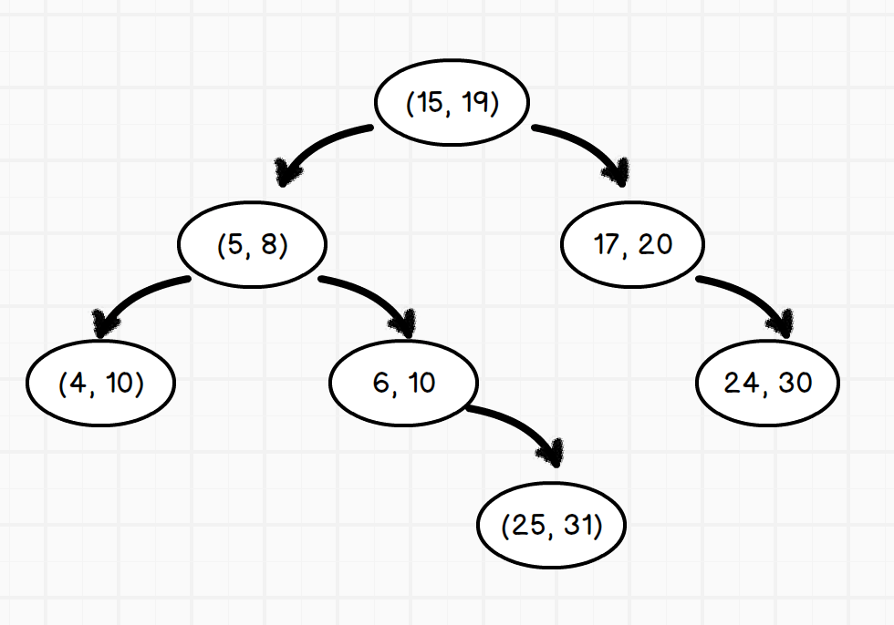
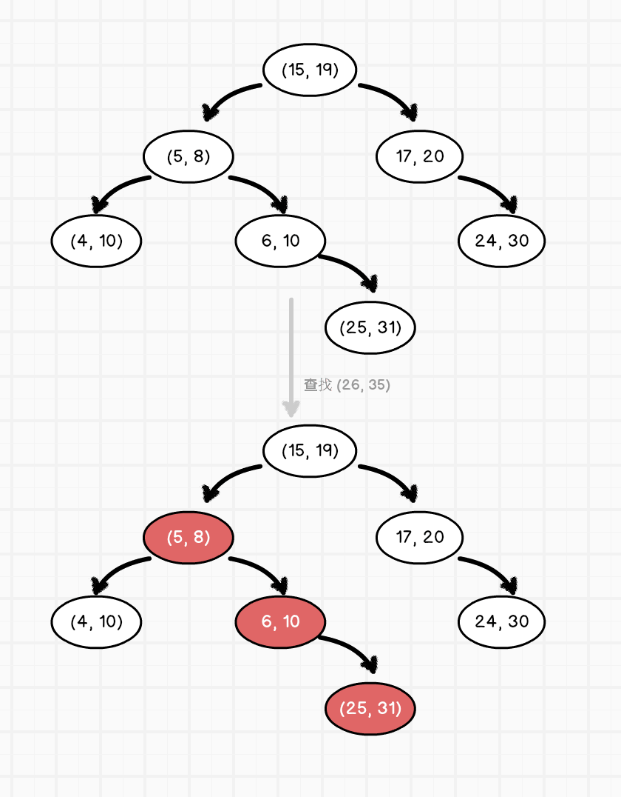

<!-- START doctoc generated TOC please keep comment here to allow auto update -->
<!-- DON'T EDIT THIS SECTION, INSTEAD RE-RUN doctoc TO UPDATE -->
**Table of Contents**  *generated with [DocToc](https://github.com/thlorenz/doctoc)*

- [区间二叉搜索树](#%E5%8C%BA%E9%97%B4%E4%BA%8C%E5%8F%89%E6%90%9C%E7%B4%A2%E6%A0%91)
  - [插入区间](#%E6%8F%92%E5%85%A5%E5%8C%BA%E9%97%B4)
  - [搜索](#%E6%90%9C%E7%B4%A2)

<!-- END doctoc generated TOC please keep comment here to allow auto update -->

## 区间二叉搜索树

区间二叉搜索树，也叫线段树，是二叉树的一种。但它最大的不同是，它的每个节点储存的都是一个区间而不是数字，即 `[start, end]` ，而其左右子树，则是根据插入区间的左端点大小进行比较来决定的。在区间树同一层的节点所代表的区间，相互不会重叠。

换句话来说，在区间二叉搜索树中插入元素时，一律比较区间最小值，根据比较结果来确定插入左子树还是右子树。

### 插入区间

插入的过程如上所说，比较各个节点的最小值和待插入区间的最小值，以此来确定插入的是左子节点还是右子节点。

### 搜索

在搜索过程中，比较的是目标区间的最大值和各个区间的最大值：

- 如果某个节点区间和目标区间相交，则搜索结束，返回当前节点区间
- 如果左子节点为空，则搜索右子树
- 如果左子树的最大值小于目标区间的最小值，则搜索右子树
- 否则搜索左子树

**注意，在确定搜索左还是右子树的时候，目标区间和左子树的最大值进行比较。而这个最大值并不是当前节点直接左子树的节点的最大值，而是整颗左子树里的最大值。**

